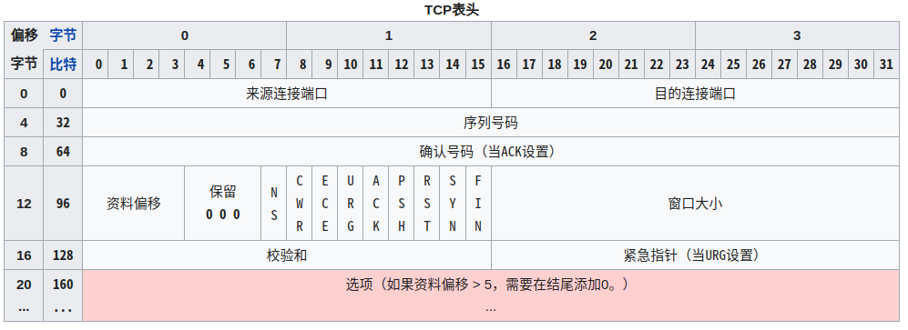

# adb + tcpdump + wireshark Android抓包

## 环境搭建

> tcpdump和wireshark原理一样是基于分析操作系统网络日志，对比基于代理的抓包方式，功能更强大，信息更全。
>
> tcpdump Linux系统默认就有安装，我的Linux Mint 查看是在/usr/sbin/tcpdump。只不过自带的可能版本比较老。
>
> $ tcpdump --version
>
> tcpdump version 4.9.2
> libpcap version 1.8.1
> OpenSSL 1.1.1  11 Sep 2018

1. 安装[Android平台工具包](https://dl.google.com/android/repository/platform-tools-latest-linux.zip?hl=zh-cn)，包含adb；

2. 手机开启开发者选项并打开USB调试(调整到`传输文件/Android Auto`, 如果是`仅充电`是无法识别设备的)；

3. 查看usb设备；

   ```shell
   $ lsusb
   Bus 001 Device 026: ID 18d1:4ee8 Google Inc. 4
   ```

4. Linux编辑 `/etc/udev/rules.d/51-android.rules `（可选，识别不到设备时尝试）

    ```rules
    SUBSYSTEM=="usb", ATTRS{idVendor}=="18d1", 	ATTRS{idProduct}=="4ee8",MODE="0666",GROUP="plugdev"
    ```

5. Linux编辑 `~/.android/adb_usb.ini`（可选，识别不到设备时尝试）

    ```ini
    # OPPO Find X5 Pro
    0x18d1
    ```

6. 重启adb

    ```shell
    sudo service udev restart  
    sudo adb kill-server
    sudo adb start-server
    sudo adb devices
    ```
    

7. 下载 [tcpdump](https://www.tcpdump.org/release/libpcap-1.10.3.tar.gz) 并传输到Android手机

   官网下载的需要先编译安装，但是因为本地环境版本等问题编译报错，

   选择下载从这个网站下载二进制文件 https://www.androidtcpdump.com/android-tcpdump/downloads

   然后推到Android文件目录

   ```shell
   adb push ~/tool/tcpdump /data/local/tmp/
   ```

8. 连接Android终端

   ```shell
   adb shell
   cd /data/local/tmp
   chmod +x tcpdump
   ```

   然后就可以在Android中启动tcpdump抓包了。

9. 静态抓包

   先使用tcpdump在Android上抓取数据并写入文件，然后将文件推到本地工作站上用Wireshark分析。

   这个不说了，使用起来比较麻烦。

   同样也需要获取Android手机Root权限。

10. 动态抓包

    在本地工作站上通过ssh远程登录Android手机并执行tcpdump抓包命令，输出数据实时发送给Wireshark分析。

    先保障Android和本地工作站在同一网络；

    然后在Android手机上安装SSH Server（这里用SSHDroid）并启动，这是比较偷懒的方式，不嫌麻烦的可以在Android上安装命令行工具，像在电脑上一样安装SSH Server。

    在Android上使用SSH还是需要获取ROOT权限，不然无法执行 tcpdump 。算了改天换个旧手机ROOT后试试。

    ```shell
    # SSHDroid 默认端口是 2222
    scp -P 2222 ~/tool/tcpdump root@192.168.31.202:/data/data/berserker.android.apps.sshdroid/home
    chmod +x tcpdump
    tcpdump -i eth0 -nn -s0 -v port 443
    ```


## 抓包

上面的配置好后，手机上抓包和本地电脑上抓包是一样的。

由于暂时没有合适的可ROOT的手机，下面都是在本地电脑上测试的，只是归纳下常用的方法。

参考资料：man tcpdump、官网有提供一些资料（如：[A tcpdump tutorial with examples](https://danielmiessler.com/study/tcpdump/)）、[超详细的网络抓包神器 Tcpdump 使用指南](https://cloud.tencent.com/developer/article/1589827) (原文：[Tcpdump Examples](https://hackertarget.com/tcpdump-examples/))

这些参数肯定会忘的，用到时查这些资料就行。

注意运行需要超级用户权限。

案例：

```shell
# 抓取本机到某个IP(比如baidu.com)之间的数据
tcpdump -i wlp4s0 -nn -s0 -v -A host 14.215.177.39
tcpdump -i wlp4s0 -nn -s0 -v -A dst 14.215.177.39
# 抓取tcp协议数据
tcpdump -i wlp4s0 proto 6
# 端口过滤
tcpdump portrange 21-23
tcpdump dst port 9002
# 本地发往或来自本地端口9002的数据
tcpdump -i lo -nn -s0 -v -A dst port 9002 or src port 9002
# 本地发往或来自本地端口9002的数据
tcpdump -i lo -nn -s0 -v -A dst port 9002 or src port 9002 -w test.pcap
```

按TCP标志过滤（结合TCP协议header结构看，中括号中是标志位的偏移量）：

TCP协议头结构(图片来源于维基百科):



```shell
# 筛选 RST 标志，标志位在第13个（从0开始）字节中存储
tcpdump 'tcp[13] & 4!=0'
# 筛选 ACK 标志
tcpdump 'tcp[13] & 16!=0'
# 筛选 FIN 标志
tcpdump 'tcp[13] & 1!=0'
```

SSH远程抓包将内容重定向到Wireshark:

```shell
ssh root@remotesystem 'tcpdump -s0 -c 1000 -nn -w - not port 22' | wireshark -k -i -
```

抓包内容：

```shell
# 比如下面依次是三次握手，协议升级(websocket)，websocket请求与响应
root@lee-pc:/opt/platform-tools# tcpdump -i lo -nn -s0 -v -A dst port 9002 or src port 9002
tcpdump: listening on lo, link-type EN10MB (Ethernet), capture size 262144 bytes


15:16:12.100833 IP (tos 0x0, ttl 64, id 1755, offset 0, flags [DF], proto TCP (6), length 60)
    127.0.0.1.42410 > 127.0.0.1.9002: Flags [S], cksum 0xfe30 (incorrect -> 0x0cec), seq 46696797, win 65495, options [mss 65495,sackOK,TS val 3484360300 ecr 0,nop,wscale 7], length 0
E..<..@.@.5...........#*...].........0.........
...l........
15:16:12.100844 IP (tos 0x0, ttl 64, id 0, offset 0, flags [DF], proto TCP (6), length 60)
    127.0.0.1.9002 > 127.0.0.1.42410: Flags [S.], cksum 0xfe30 (incorrect -> 0xa9d7), seq 18248669, ack 46696798, win 65483, options [mss 65495,sackOK,TS val 3484360300 ecr 3484360300,nop,wscale 7], length 0
E..<..@.@.<.........#*....s....^.....0.........
...l...l....
15:16:12.100854 IP (tos 0x0, ttl 64, id 1756, offset 0, flags [DF], proto TCP (6), length 52)
    127.0.0.1.42410 > 127.0.0.1.9002: Flags [.], cksum 0xfe28 (incorrect -> 0xd093), ack 1, win 512, options [nop,nop,TS val 3484360300 ecr 3484360300], length 0
E..4..@.@.5...........#*...^..s......(.....
...l...l
15:16:12.101089 IP (tos 0x0, ttl 64, id 1757, offset 0, flags [DF], proto TCP (6), length 275)
    127.0.0.1.42410 > 127.0.0.1.9002: Flags [P.], cksum 0xff07 (incorrect -> 0x5bc9), seq 1:224, ack 1, win 512, options [nop,nop,TS val 3484360300 ecr 3484360300], length 223
E.....@.@.5...........#*...^..s............
...l...lGET / HTTP/1.1
Sec-WebSocket-Version: 13
Sec-WebSocket-Key: JSeEjTJKSVid2tmpIU9LqA==
Connection: Upgrade
Upgrade: websocket
Sec-WebSocket-Extensions: permessage-deflate; client_max_window_bits
Host: 127.0.0.1:9002


15:16:12.101094 IP (tos 0x0, ttl 64, id 64600, offset 0, flags [DF], proto TCP (6), length 52)
    127.0.0.1.9002 > 127.0.0.1.42410: Flags [.], cksum 0xfe28 (incorrect -> 0xcfb4), ack 224, win 512, options [nop,nop,TS val 3484360300 ecr 3484360300], length 0
E..4.X@.@.@i........#*....s....=.....(.....
...l...l
15:16:12.103754 IP (tos 0x0, ttl 64, id 64601, offset 0, flags [DF], proto TCP (6), length 181)
    127.0.0.1.9002 > 127.0.0.1.42410: Flags [P.], cksum 0xfea9 (incorrect -> 0x9105), seq 1:130, ack 224, win 512, options [nop,nop,TS val 3484360303 ecr 3484360300], length 129
E....Y@.@.?.........#*....s....=...........
...o...lHTTP/1.1 101 Switching Protocols
upgrade: websocket
connection: upgrade
sec-websocket-accept: ytjhVShhbpuAYLCcAa4mNx0/o6g=


15:16:12.103765 IP (tos 0x0, ttl 64, id 1758, offset 0, flags [DF], proto TCP (6), length 52)
    127.0.0.1.42410 > 127.0.0.1.9002: Flags [.], cksum 0xfe28 (incorrect -> 0xcf2e), ack 130, win 511, options [nop,nop,TS val 3484360303 ecr 3484360303], length 0
E..4..@.@.5...........#*...=..t_.....(.....
...o...o
15:16:12.127641 IP (tos 0x0, ttl 64, id 1759, offset 0, flags [DF], proto TCP (6), length 252)
    127.0.0.1.42410 > 127.0.0.1.9002: Flags [P.], cksum 0xfef0 (incorrect -> 0xc724), seq 224:424, ack 130, win 512, options [nop,nop,TS val 3484360326 ecr 3484360303], length 200
E.....@.@.5...........#*...=..t_...........
.......o....i.."....I..W...k....Y...^...Q...Z..(I...K..F....P...E...I..F....S..(I...I...K..N...R....X...I...I......N:..v....S..(I...I...K..P...W...C...v....S..(I...I...K..M=..GK...c...I...I..M....S...c...I.._
15:16:12.130839 IP (tos 0x0, ttl 64, id 64602, offset 0, flags [DF], proto TCP (6), length 2516)
    127.0.0.1.9002 > 127.0.0.1.42410: Flags [P.], cksum 0x07c9 (incorrect -> 0x341e), seq 130:2594, ack 424, win 512, options [nop,nop,TS val 3484360330 ecr 3484360326], length 2464
E.	..Z@.@.6.........#*....t_...............
.........~	.{"code":9054,"data":{"goodsList":[{"bindRoomType":4,"height":399,"inShop":1,"isNew":0,"isoType":6,"itemId":482,"name":"??????","price":7000,"priority":64820,"subType":1,"tier":400,"type":1,"width":496},{"bindRoomType":0,"height":145,"inShop":1,"isNew":0,"isoType":9,"itemId":481,"name":"???????","price":3600,"priority":64810,"subType":1,"tier":400,"type":1,"width":122},{"bindRoomType":4,"height":464,"inShop":1,"isNew":0,"isoType":6,"itemId":480,"name":"???????","price":7000,"priority":64800,"subType":1,"tier":400,"type":1,"width":290},{"bindRoomType":4,"height":239,"inShop":1,"isNew":0,"isoType":6,"itemId":479,"name":"??????","price":3600,"priority":64790,"subType":1,"tier":400,"type":1,"width":140},{"bindRoomType":0,"height":257,"inShop":1,"isNew":0,"isoType":6,"itemId":478,"name":"???????","price":3200,"priority":64780,"subType":1,"tier":300,"type":1,"width":233},{"bindRoomType":0,"height":69,"inShop":1,"isNew":0,"isoType":17,"itemId":477,"name":"?????","price":1800,"priority":64770,"subType":1,"tier":200,"type":1,"width":427},{"bindRoomType":0,"height":732,"inShop":1,"isNew":0,"isoType":12,"itemId":476,"name":"??????","price":2500,"priority":64760,"subType":1,"tier":100,"type":1,"width":750},{"bindRoomType":0,"height":892,"inShop":1,"isNew":0,"isoType":13,"itemId":475,"name":"???????","price":2500,"priority":64750,"subType":1,"tier":50,"type":1,"width":750},{"bindRoomType":3,"height":274,"inShop":1,"isNew":0,"isoType":5,"itemId":474,"name":"??????","price":6300,"priority":64740,"subType":1,"tier":400,"type":1,"width":288},{"bindRoomType":0,"height":226,"inShop":1,"isNew":0,"isoType":2,"itemId":473,"name":"?????-?","price":2600,"priority":64730,"subType":1,"tier":400,"type":1,"width":128}],"goodsTypeInfo":{"childrenTypes":{"current":0,"goodsTypes":[{"name":"......","type":0},{"name":"......","type":1},{"name":"......","type":2},{"name":"......","type":3},{"name":"...","type":4},{"name":"......","type":5},{"name":"......","type":6},{"name":"......","type":7},{"name":"......","type":8},{"name":"......","type":9},{"name":"......","type":10},{"name":"......","type":11},{"name":"......","type":12},{"name":"......","type":13},{"name":"......","type":14},{"name":"............","type":16},{"name":"............","type":17}]},"current":0,"goodsTypes":[{"name":"......","type":0},{"name":"......","type":1},{"name":"......","type":2},{"name":"......","type":3},{"name":"......","type":4},{"name":"......","type":5}]}},"errCode":1}
15:16:12.175220 IP (tos 0x0, ttl 64, id 1760, offset 0, flags [DF], proto TCP (6), length 52)
    127.0.0.1.42410 > 127.0.0.1.9002: Flags [.], cksum 0xfe28 (incorrect -> 0xc463), ack 2594, win 512, options [nop,nop,TS val 3484360374 ecr 3484360330], length 0
E..4..@.@.5...........#*......}......(.....
........
```


